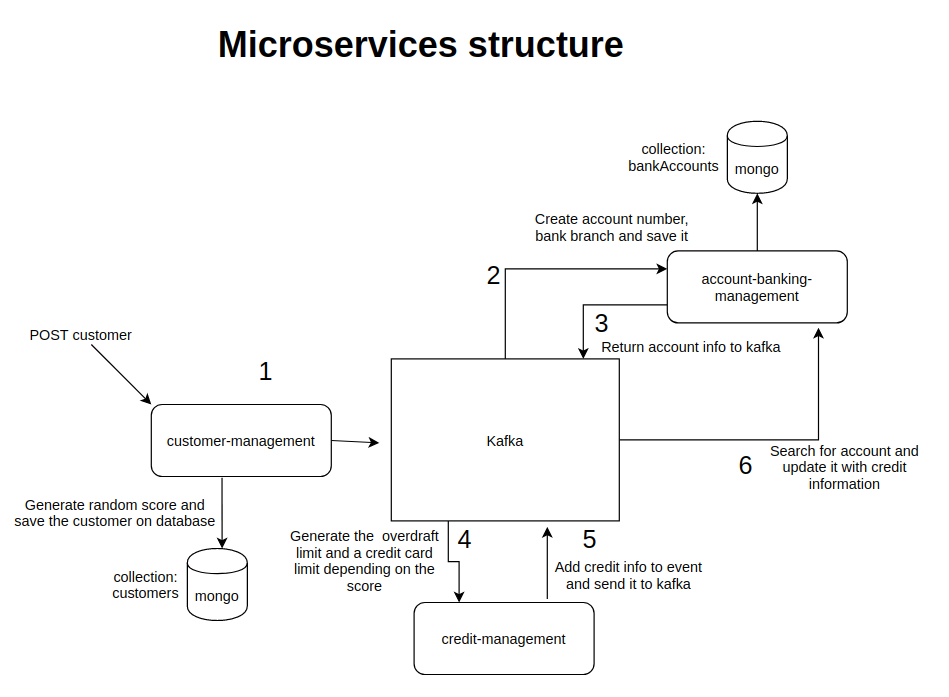

# Banking System

## Technologies used

 - **Java 8 - MongoDB - Spring Kafka - Swagger - Lombok - Spring boot - Spring Web**

## What the application does
Create a new customer, when customer is created, it will automatically open a banking account linked to this customer. After registering the account, the overdraft limit and a credit card is created, linked to the account created.
## What you'll need to run it

 - Mongodb running in the default port
 - Kafka running in the default port
 - docker-compose installed (if you'll run kafka with docker-compose)

### Running Kafka with  docker-compose

 - Clone this project `git clone [https://github.com/confluentinc/cp-docker-images](https://github.com/confluentinc/cp-docker-images)`
 - After cloned, navigate to the folder *cp-docker-images/examples/kafka-single-node*
 - Now inside the folder, run `sudo docker-compose up -d.` The -d is used to run in the background.
 - Type it on terminal to check kafka health `sudo docker-compose logs kafka | grep -i started` you'll see a log like below:
```kafka_1 | [2018-06-27 20:03:50,641] INFO [SocketServer brokerId=1] Started 1 acceptor threads (kafka.network.SocketServer)  
    kafka_1 | [2018-06-27 20:03:50,898] INFO [SocketServer brokerId=1] Started processors for 1 acceptors (kafka.network.SocketServer)  
    kafka_1 | [2018-06-27 20:03:50,900] INFO [KafkaServer id=1] started (kafka.server.KafkaServer)  
    kafka_1 | [2018-06-27 20:03:50,911] INFO [ReplicaStateMachine controllerId=1] Started replica state machine with initial state -> Map() (kafka.controller.ReplicaStateMachine)  
    kafka_1 | [2018-06-27 20:03:50,914] INFO [PartitionStateMachine controllerId=1] Started partition state machine with initial state -> Map() (kafka.controller.PartitionStateMachine)
```

 ## How to run the project
 
 - Clone the project
 - Get in the folder each microservice and type it on terminal: `./gradlew bootRun` await the program up
 - Go to localhost: [http://localhost:8181/swagger-ui.html](http://localhost:8080/swagger-ui.html) to send a POST to create a new customer and list all
 - Go to [http://localhost:8080/swagger-ui.html](http://localhost:8080/swagger-ui.html) to list all accounts created
 
 
